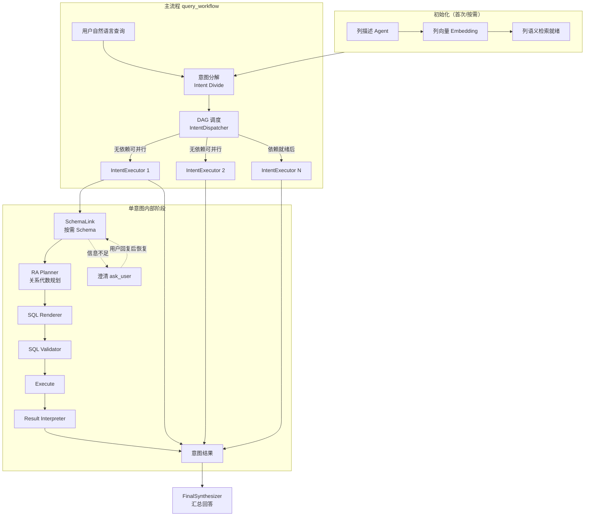

# AskDB

将自然语言查询转换为可执行 SQL 的流水线。支持多意图 DAG、按需 Schema（SchemaLink）、澄清式交互与关系代数规划。

## 项目特点

与常见「一问一 SQL」的 NL2SQL 不同，本项目的核心差异如下：

| 特点 | 说明 |
|------|------|
| **1. 多意图 + DAG** | 一句自然语言 → 拆成多个子意图，意图之间有依赖关系，形成 DAG；无依赖的意图可并行执行，不是「一问一 SQL」。 |
| **2. 按需 Schema（SchemaLink）** | 不做全库 schema 灌入，而是按意图按需构建最小 schema（BUILD/ENRICH），由 SchemaLink 子系统多轮规划 + 工具补齐。 |
| **3. 澄清式交互** | 信息不足时暂停执行、向用户提问（ask_user / dialog ticket），用户回复后在原状态上恢复继续，而不是简单多轮闲聊。 |
| **4. 关系代数中间层** | 每个意图先做 RA 规划（entities / joins / filters / checks），再从 RA 渲染 SQL，是「规划 → 渲染」而不是直接 text-to-SQL。 |
| **5. 列级语义** | 初始化阶段做列级描述与向量；意图分解时用列语义检索等工具，是列粒度而不是仅表名。 |
| **6. 统一查询工作流** | 对外单一阶段 `query_workflow`：意图分解、调度、单意图执行（SchemaLink → RA → SQL → 校验 → 执行 → 解释）与汇总均在同一流水线内完成。 |

## 功能展示

### 问题输入


### 执行流程


### 执行结果


## 整体流程架构



## 代码架构（简要）

- **`stages/query_workflow/`**：统一查询工作流。`runtime/query_workflow_pipeline.py` 编排分解、校验、拓扑、调度与汇总；`execution/intent_executor.py` 驱动单意图阶段机；`schemalink/` 为按需 schema 子系统（引擎、校验、图、工具编排）；`agents/` 为各 LLM Agent（统一基类 `BaseAgent`）；`tools/` 为模型可调工具；`repositories/workflow_store.py` 等持久化工作流状态。
- **`stages/initialize/`**：库表列描述 Agent、README 生成与向量嵌入构建，产物写入 `data/initialize/`。
- **`config/`**：`app_config.py` 加载 `config/json/*.json`；`llm_config.py` 按**模型 code**构造 LangChain 客户端（`models.json` 为「供应商 + 模型 code」结构，见 [config/README.md](config/README.md)）。
- **`api/`**：FastAPI 应用（配置读写、初始化任务、查询同步/异步/SSE），供 [README_WEB.md](README_WEB.md) 中的 Web 前端使用。
- **`utils/`**：数据库访问、路径（`data/`、`log/`）、日志、嵌入工具等。
- **`main.py`**：命令行入口，可选自动补齐初始化产物后进入交互或单次查询。

更细的设计背景见 `stages/REBUILD.md` 与 `docs/design/` 下各文档。

## 功能概览

- **意图分解**：将用户问句拆成带依赖的子意图，并由校验 Agent 约束结构。
- **DAG 调度**：按依赖顺序执行，无依赖意图并行（`IntentWorkerPool`）。
- **单意图执行**：SchemaLink → RA → SQL → 校验 → 执行 → 解释；错误可走归因与修复策略。
- **澄清对话**：工作流级 ask 队列与 ticket，CLI 或 API 均可 resume。
- **初始化**：列描述 JSON + 列向量，供查询阶段语义检索使用。

## 环境要求

- Python 3.10+
- MySQL（或兼容协议）数据库
- 兼容 OpenAI API 的 LLM 网关（如 Qwen 百炼 compatible-mode、DeepSeek、OpenAI 等），在 `config/json/models.json` 的 `providers` 中配置；密钥通过 `.env` 与 `api_key_env` 注入

## 快速开始

**使用前请完成：**

1. **环境变量**：在项目根目录执行 `cp .env.example .env`，编辑 `.env` 填入数据库密码与各供应商的 API Key（见 `.env.example` 注释与 [config/README.md](config/README.md)）。
2. **JSON 配置**：按需修改 `config/json/` 下的 `database.json`、`models.json`、`stages.json`。

### 1. 安装依赖

```bash
pip install -r requirements.txt
```

### 2. 配置

- **数据库**：`config/json/database.json` 中 `default_connection`、`default_scope` / `query_databases`、`connections` 等。
- **模型**：`models.json` 使用 **`providers`**：每个供应商配置 `api_key` / `base_url`（及 `*_env`），其下 `models` 的**键名为模型 code**，业务与 `stages.json` 中的 `model_name` 均引用该 code；条目内 `code` 字段为厂商 API 模型 id（可省略则等于键名）。详见 [config/README.md](config/README.md)。
- **阶段参数**：`stages.json` 中 `query_workflow`、`initialize`、`general`、`column_agent` 等。

### 3. 命令行运行

**交互式**（默认会检查并尝试补齐 initialize 产物）：

```bash
python main.py
```

按提示输入自然语言；若需澄清，按提示补充后继续。输入 `exit` 或 `quit` 退出。

**单次查询**：

```bash
python main.py --query "查询每个工厂的设备数量"
```

**跳过初始化检查**（已确认 `data/initialize` 与 embedding 就绪时）：

```bash
python main.py --skip-init --query "你的问题"
```

### 4. Web 界面与 HTTP API

提供 Vue 3 前端与 FastAPI 后端（配置页、初始化进度、问答与澄清续跑）。启动方式与 API 说明见 **[README_WEB.md](README_WEB.md)**。

### 5. 配置目录

使用独立配置目录时：

```bash
export APP_CONFIG_DIR=/path/to/your/config
python main.py
```

该目录下需包含 `database.json`、`models.json`、`stages.json`。

## 运行时数据目录

由 `utils/data_paths.DataPaths` 统一管理，启动时会创建必要子目录：

| 路径 | 用途 |
|------|------|
| `data/initialize/agent/` | 列描述等 Agent 产物 |
| `data/initialize/embedding/` | 列向量嵌入 |
| `data/initialize/checkpoints/` 等 | 初始化检查点与进度 |
| `data/models/embedding/` | 嵌入模型缓存（可选） |
| `log/` | 请求级日志等 |

## 项目结构（目录级）

```
api/                    # FastAPI：/api/config、/api/init、/api/query
config/                 # 配置加载与 LLM 工厂（json 在 config/json/）
docs/design/            # 设计文档（流程、协议、Web 规划等）
stages/
  initialize/           # 初始化：列 Agent、embedding、readme 等
  query_workflow/       # 统一查询工作流（见上文「代码架构」）
  general/              # 如摘要等横切能力
utils/                  # DB、路径、日志、embedding 等
web/                    # Vue 3 + Vite 前端（见 README_WEB.md）
tests/                  # pytest 用例
main.py                 # CLI 入口
```

## 参考文献及项目

与 Text-to-SQL、Schema Linking、分解式生成等相关的阅读列表见 [docs/REFERENCES.md](docs/REFERENCES.md)。

## 许可证

本项目采用 [MIT License](LICENSE)。
