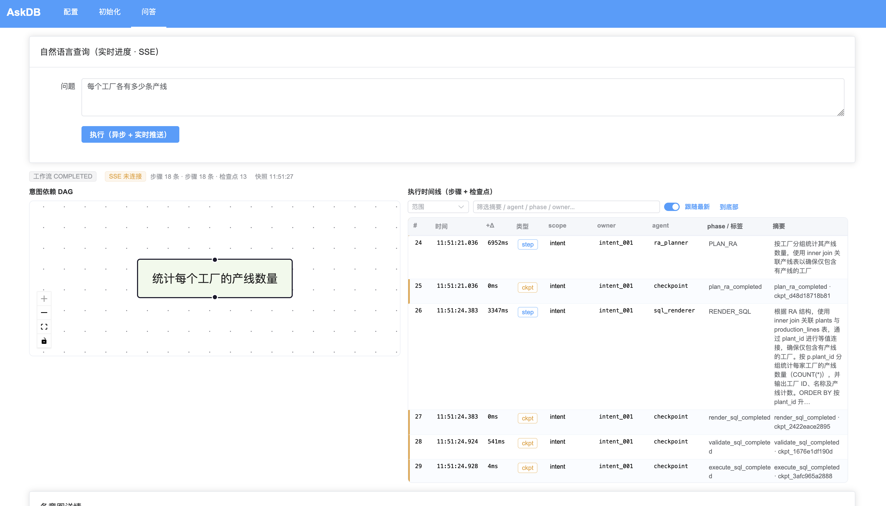
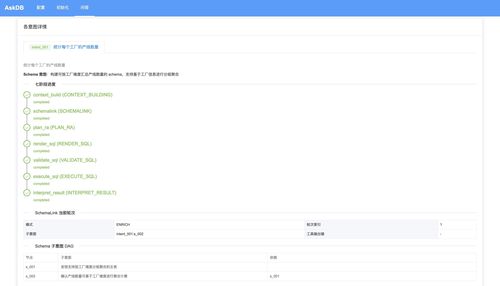
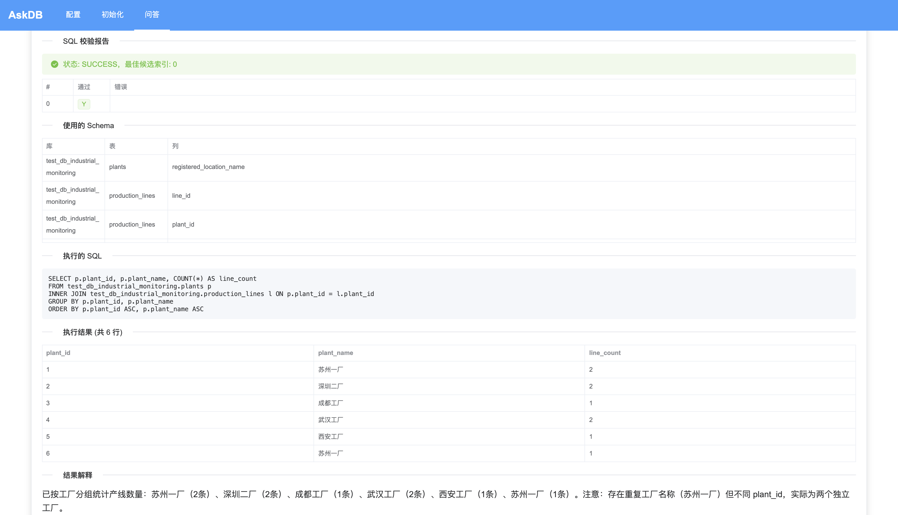
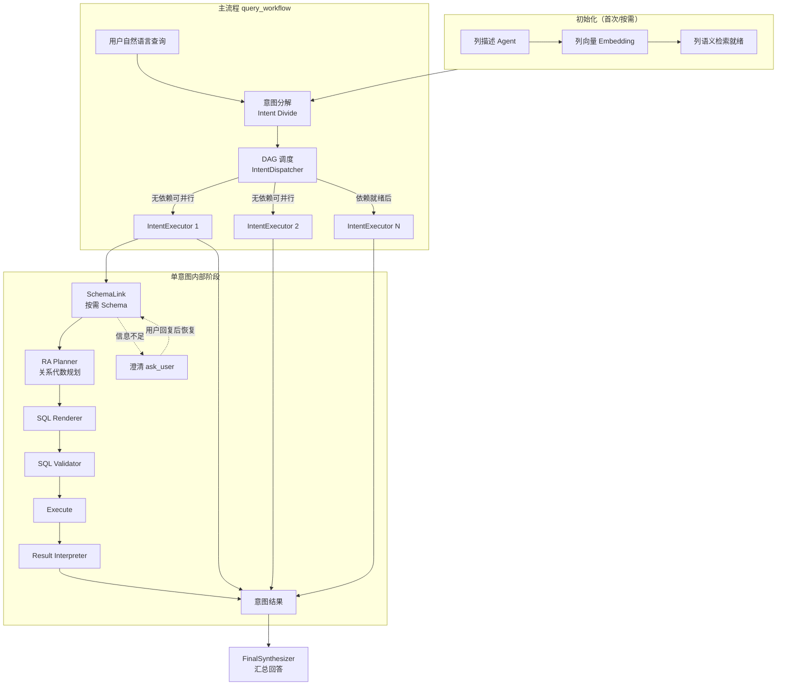

# AskDB

将自然语言查询转换为可执行 SQL 的流水线。支持多意图 DAG、按需 Schema（SchemaLink）、澄清式交互与关系代数规划。

## 项目特点

与常见「一问一 SQL」的 NL2SQL 不同，本项目的核心差异如下：

| 特点 | 说明 |
|------|------|
| **1. 多意图 + DAG** | 一句自然语言 → 拆成多个子意图，意图之间有依赖关系，形成 DAG；无依赖的意图可并行执行，不是「一问一 SQL」。 |
| **2. 按需 Schema（SchemaLink）** | 不做全库 schema 灌入，而是按意图按需构建最小 schema（BUILD/ENRICH），由 SchemaLink 子系统多轮规划 + 工具补齐。 |
| **3. 澄清式交互** | 信息不足时暂停执行、向用户提问（ask_user / dialog ticket），用户回复后在原状态上恢复继续，而不是简单多轮闲聊。 |
| **4. 关系代数中间层** | 每个意图先做 RA 规划（entities / joins / filters / checks），再从 RA 渲染 SQL，是「规划 → 渲染」而不是直接 text-to-SQL。 |
| **5. 列级语义** | 初始化阶段做列级描述与向量；意图分解时用列语义检索等工具，是列粒度而不是仅表名。 |
| **6. 统一查询工作流** | 对外单一阶段 `query_workflow`：意图分解、调度、单意图执行（SchemaLink → RA → SQL → 校验 → 执行 → 解释）与汇总均在同一流水线内完成。 |

## 功能展示

### 问题输入


### 执行流程


### 执行结果


## 整体流程架构



## 代码架构（简要）

- **`stages/query_workflow/`**：统一查询工作流。`runtime/query_workflow_pipeline.py` 编排分解、校验、拓扑、调度与汇总；`execution/intent_executor.py` 驱动单意图阶段机；`schemalink/` 为按需 schema 子系统（引擎、校验、图、工具编排）；`agents/` 为各 LLM Agent（统一基类 `BaseAgent`）；`tools/` 为模型可调工具；`repositories/workflow_store.py` 等持久化工作流状态。
- **`stages/initialize/`**：库表列描述 Agent、README 生成与向量嵌入构建，产物写入 `data/initialize/`。
- **`config/`**：`app_config.py` 加载 `config/json/*.json`；`llm_config.py` 按**模型 code**构造 LangChain 客户端（`models.json` 为「供应商 + 模型 code」结构，见 [config/README.md](config/README.md)）。
- **`api/`**：FastAPI 应用（配置读写、初始化任务、查询同步/异步/SSE），供 [README_WEB.md](README_WEB.md) 中的 Web 前端使用。
- **`utils/`**：数据库访问、路径（`data/`、`log/`）、日志、嵌入工具等。
- **`main.py`**：命令行入口，可选自动补齐初始化产物后进入交互或单次查询。

更细的设计背景见 `stages/REBUILD.md` 与 `docs/design/` 下各文档。

## 功能概览

- **意图分解**：将用户问句拆成带依赖的子意图，并由校验 Agent 约束结构。
- **DAG 调度**：按依赖顺序执行，无依赖意图并行（`IntentWorkerPool`）。
- **单意图执行**：SchemaLink → RA → SQL → 校验 → 执行 → 解释；错误可走归因与修复策略。
- **澄清对话**：工作流级 ask 队列与 ticket，CLI 或 API 均可 resume。
- **初始化**：列描述 JSON + 列向量，供查询阶段语义检索使用。

## 准确性如何保证（设计与实现）

AskDB 不依赖「单次 text-to-SQL」，而是用**分层约束 + 可执行校验 + 失败修复/澄清**把错误暴露在执行前或执行后解释阶段。下面按代码中的真实路径说明（对应 `stages/query_workflow/`）。

### 1. 工作流层：拆分与拓扑必须「可执行」

- **意图拆分校验**：`QueryWorkflowPipeline` 在 `_run_from_decompose` 中先跑 `IntentDecomposerAgent`，再用 `IntentDecomposeValidatorAgent` 对照**原始问题**检查拆分是否独立、query/schema 是否一一对应、是否强耦合不可独立求解；不通过则带 `issues` / `suggested_fix` 触发**有限次自修复重试**（`max_decompose_self_repair`），仍失败则走 **ask_user** 澄清，而不是硬跑错误 DAG。
- **拓扑合法性**：拆分通过后由 `IntentTopologyBuilder` 构建 DAG；构建失败同样发AskUser请求，避免依赖不清的执行顺序。

### 2. SchemaLink：结构校验 → 确定性缺口 → LLM 充分性

- **SchemaGate**（`schemalink/schema_gate.py`）在宣告 SchemaLink 成功前依次：**结构校验**（`SchemaValidator` + `database_scope`）、**确定性充分性**（`deterministic_sufficiency`，schema自洽自回归）、再必要时 **LLM 充分性**（`SchemaSufficiencyValidator`）；LLM 结果带 LRU 缓存，减少抖动。
- **信息不足则停**：SchemaLink 可走 `WAIT_USER`，把缺口交给用户补充后再 `resume`，避免在缺表缺列时瞎生成 SQL。

### 3. 关系代数层：对齐 schema + 可失败

- **提示约束**：`RAPlannerAgent` 要求只用 `resolved_schema` 中对象、不编造 join/过滤/聚合口径，并消费上一轮 **`sql_validation_feedback`** 纠偏。
- **程序后验**：`RAPlannerAgent.post_validate` 用 `resolved_schema` 校验 RA 中 **entity 表、列、join 键**均在允许集合内；`plan_kind == "set"` 时强制至少两条 `set_branches`。不通过直接抛错，进入错误路由而非静默继续。

### 4. SQL 层：语法/安全/可解析 + 数据库 EXPLAIN + 输出列对齐

`SQLValidator`（`execution/sql_validator.py`）对每个候选 SQL：

- 用 **sqlparse** 限制为**单条**、仅 **SELECT / WITH**、扫描 token 拒绝常见 **DML/DDL** 关键字；
- 在只读连接上对 **`EXPLAIN` + SQL** 做**真机校验**（语法与对象在引擎侧是否成立）；
- 若渲染结果带了 **`expected_columns`**，则从 SELECT 列表做**列血缘/别名**提取（含 `*` 的宽松处理），缺列则该候选失败；多个候选时取**第一个全通过**的索引。

这是**确定性**闸门，与模型无关。

### 5. 语义层：SQL 是否「答非所问」

在通过上述校验后，`IntentExecutor` 还会调用 **`SQLValidationAgent`**（`agents/sql_validation_agent.py`）：把 **intent、结构化 RA、候选 SQL、schema**一并交给模型做 **ok/fail** 语义判决（多写了条件、漏条件、口径与 RA 不一致等均判 fail）。`fail` 会写入 **`sql_validation_feedback`** 并触发 **`RepairAction.REPLAN_RA`**，清空 RA/SQL 相关状态回到规划阶段，在 **`max_repair_attempts`** 内循环修复。

### 6. 执行与解释：只读、限量、不编造结果

- **执行**：`SQLExecutor` 使用 `readonly=True` 的查询接口，并受 **`sql_timeout_ms`** 与 **`max_rows`** 限制；超行会标记 `truncated`。
- **单意图解释**：`ResultInterpreterAgent` 规则要求**只解释 `execution_result` 中真实数据**，输出 **`confidence` / `assumptions` / `missing_information`**，空结果或不确定须明确说明。
- **最终汇总**：`FinalSynthesizerAgent` 约束为**只汇总各 intent 已有结论**，不重新推导 SQL、不编造未完成意图的答案；若汇总模型失败，`ResultSynthesizer` **回退为拼接已完成 intent 的 answer**，避免静默胡编。

### 7. 其他运行时护栏

- **错误归因与修复**：`ErrorRouter` 将异常映射为 `RepairAction`（如重建 schema、重渲染 SQL、重执行等），由 `IntentExecutor._apply_repair` 回到对应阶段。
- **步数上限**：`WorkflowStepLimiter` 限制工作流步骤追加，防止无限重试（超限会报 `WORKFLOW_STEP_LIMIT_EXCEEDED`）。

### 需要了解的边界

- **LLM 阶段**（拆分评估、充分性、RA、渲染、语义校验、解释、汇总）在提示与 JSON 契约上尽量收紧，但**不能保证 100% 正确**；**EXPLAIN、只读执行、schema/post_validate、确定性校验**提供的是「可证伪」护栏。
- **语义校验**本身是模型判断，与 RA/SQL 校验互为补充；若业务极关键，应把本系统输出视为**辅助**，关键 SQL 仍需人工或离线测试集复核。

## 不足
### 一些其他工具需要不足
- 测试发现，系统在较复杂的SQL生成或者查询需求时表现稳定，但是在一些简单需求，涉及复杂的字符串正则匹配等这种任务时，表现反而不好
- 后续需要引入专门的此类子系统如正则表达式生成Agent或者正则表达确定性规则库

## 环境要求

- Python 3.10+
- MySQL（或兼容协议）数据库
- 兼容 OpenAI API 的 LLM 网关（如 Qwen 百炼 compatible-mode、DeepSeek、OpenAI 等），在 `config/json/models.json` 的 `providers` 中配置；密钥通过 `.env` 与 `api_key_env` 注入

## 快速开始

**使用前请完成：**

1. **环境变量**：在项目根目录执行 `cp .env.example .env`，编辑 `.env` 填入数据库密码与各供应商的 API Key（见 `.env.example` 注释与 [config/README.md](config/README.md)）。
2. **JSON 配置**：按需修改 `config/json/` 下的 `database.json`、`models.json`、`stages.json`。

### 1. 安装依赖

```bash
pip install -r requirements.txt
```

### 2. 配置

- **数据库**：`config/json/database.json` 中 `default_connection`、`default_scope` / `query_databases`、`connections` 等。
- **模型**：`models.json` 使用 **`providers`**：每个供应商配置 `api_key` / `base_url`（及 `*_env`），其下 `models` 的**键名为模型 code**，业务与 `stages.json` 中的 `model_name` 均引用该 code；条目内 `code` 字段为厂商 API 模型 id（可省略则等于键名）。详见 [config/README.md](config/README.md)。
- **阶段参数**：`stages.json` 中 `query_workflow`、`initialize`、`general`、`column_agent` 等。

### 3. 命令行运行

**交互式**（默认会检查并尝试补齐 initialize 产物）：

```bash
python main.py
```

按提示输入自然语言；若需澄清，按提示补充后继续。输入 `exit` 或 `quit` 退出。

**单次查询**：

```bash
python main.py --query "查询每个工厂的设备数量"
```

**跳过初始化检查**（已确认 `data/initialize` 与 embedding 就绪时）：

```bash
python main.py --skip-init --query "你的问题"
```

### 4. Web 界面与 HTTP API

提供 Vue 3 前端与 FastAPI 后端（配置页、初始化进度、问答与澄清续跑）。启动方式与 API 说明见 **[README_WEB.md](README_WEB.md)**。

### 5. 配置目录

使用独立配置目录时：

```bash
export APP_CONFIG_DIR=/path/to/your/config
python main.py
```

该目录下需包含 `database.json`、`models.json`、`stages.json`。

## 运行时数据目录

由 `utils/data_paths.DataPaths` 统一管理，启动时会创建必要子目录：

| 路径 | 用途 |
|------|------|
| `data/initialize/agent/` | 列描述等 Agent 产物 |
| `data/initialize/embedding/` | 列向量嵌入 |
| `data/initialize/checkpoints/` 等 | 初始化检查点与进度 |
| `data/models/embedding/` | 嵌入模型缓存（可选） |
| `log/` | 请求级日志等 |

## 项目结构（目录级）

```
api/                    # FastAPI：/api/config、/api/init、/api/query
config/                 # 配置加载与 LLM 工厂（json 在 config/json/）
docs/design/            # 设计文档（流程、协议、Web 规划等）
stages/
  initialize/           # 初始化：列 Agent、embedding、readme 等
  query_workflow/       # 统一查询工作流（见上文「代码架构」）
  general/              # 如摘要等横切能力
utils/                  # DB、路径、日志、embedding 等
web/                    # Vue 3 + Vite 前端（见 README_WEB.md）
tests/                  # pytest 用例
main.py                 # CLI 入口
```

## 参考文献及项目

与 Text-to-SQL、Schema Linking、分解式生成等相关的阅读列表见 [docs/REFERENCES.md](docs/REFERENCES.md)。

## 许可证

本项目采用 [MIT License](LICENSE)。
