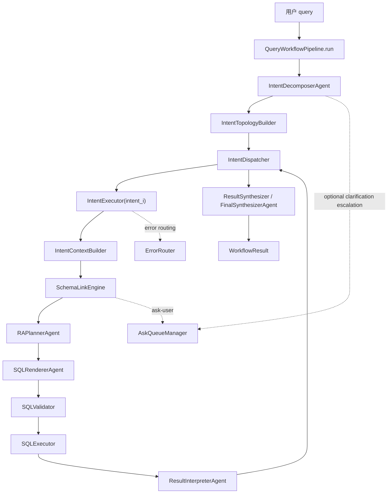
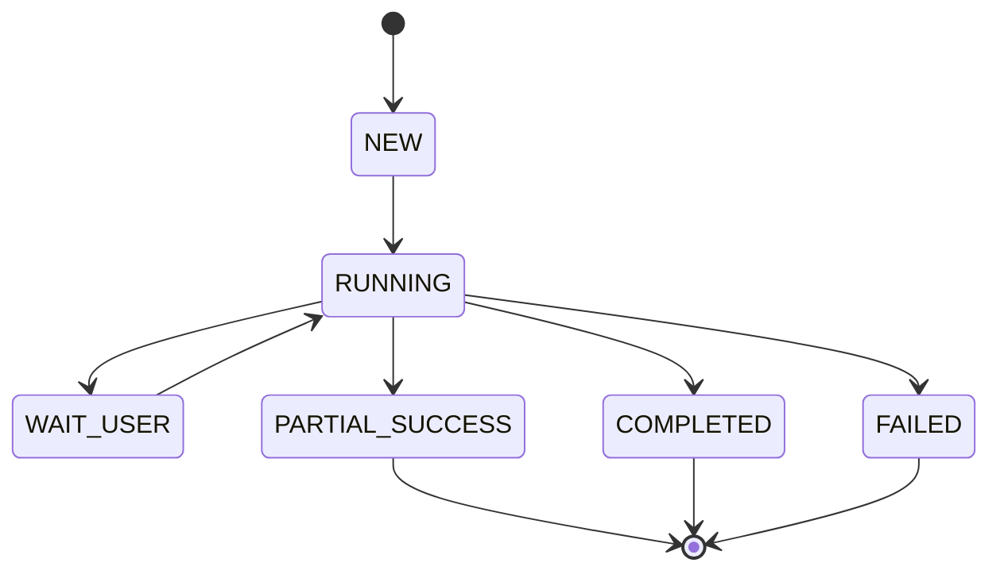
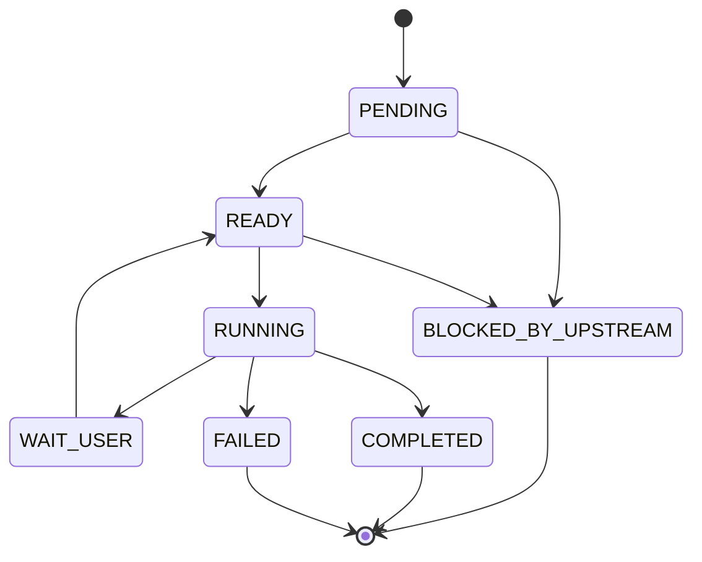
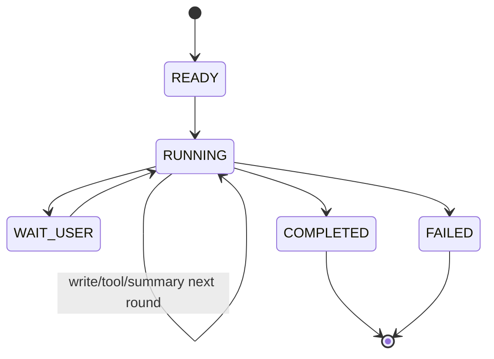

* 统一 stage：`query_workflow`
* schema 子系统：`schemalink`
* 所有 agent 统一继承：`BaseAgent`
* 审计/trace 只存在于观测层，不进入任何模型上下文，不出现在任何对模型暴露的协议里

---

# AskDB `query_workflow` 统一重构设计文档

## 1. 文档目标

本设计定义一个全新的、单入口、类化、低耦合高内聚的 AskDB 查询工作流系统，用于替代当前被拆分的 `intent_divide + sql_generation` 串联结构。

新版系统目标：

1. 将“意图拆分”和“SQL 生成执行”合并为一个统一工作流。
2. 外层只调度 intent，内层由 intent 自己完成 schema→RA→SQL→执行→解释。
3. `autolink` 正式提升为独立子系统 `schemalink`，不再伪装成普通 tool。
4. ask-user 保留，但统一收口为 workflow 级能力。
5. 每个模块都具备“责任阶段归因”能力，支持上游错误回溯。
6. 所有 agent 继承统一 `BaseAgent`，统一 JSON 输出、自动校验、自动重试、统一 steps 注入。
7. 审计、trace、tool log 完全与业务协议分离。

---

## 2. 设计原则

### 2.1 单一工作流原则

系统对外只有一个 stage：`query_workflow`。
任何 query 从进入系统到最终得到回答，都在同一个 workflow 内完成。

### 2.2 外层调度、内层执行分层原则

* 外层只处理 **intent 之间** 的 DAG 调度。
* 内层只处理 **单个 intent 内部** 的 phase 推进。
* 外层不感知 `build_schema / render_sql / validate_sql` 等内部步骤。

### 2.3 状态一等公民原则

所有可恢复、可调度、可追责的信息必须进入显式状态对象，不允许散落在多个 dict、artifact、runtime cache 中。

### 2.4 协议与观测分离原则

业务协议只承载业务需要的输入输出。
以下内容不得进入模型 prompt、tool payload、业务输出协议：

* audit
* trace_id
* event_log
* step_logs
* tool_call_trace
* 原始模型长文本输出

### 2.5 agent 与 service 分治原则

* **agent**：需要 LLM 推理的类，统一继承 `BaseAgent`
* **service**：纯逻辑/调度/执行类，不继承 agent

### 2.6 repair-first 原则

失败不是立即结束，而是先进行错误归因，再决定：

* 重试当前阶段
* 回退到责任阶段
* ask-user
* 终止

### 2.7 steps 最小必要原则

不再维护独立 memory，统一用 steps 记录每次 agent 的摘要。
steps 只保留**语义进展**，不保存原始长上下文。

---

## 3. 新包结构

```text
stages/query_workflow/
  __init__.py
  facade.py
  contracts.py
  enums.py
  state.py
  policies.py

  repositories/
    workflow_store.py
    ask_queue_store.py

  runtime/
    query_workflow_pipeline.py
    intent_topology_builder.py
    intent_dispatcher.py
    intent_worker_pool.py
    intent_context_builder.py
    result_synthesizer.py
    error_router.py

  execution/
    intent_executor.py
    sql_validator.py
    sql_executor.py
    schema_merge.py

  schemalink/
    engine.py
    schema_delta_applier.py

  agents/
    base_agent.py
    agent_runner.py

    intent_decomposer_agent.py
    schemalink_orchestrator_agent.py
    schema_builder_agent.py
    schema_tool_agent.py
    ra_planner_agent.py
    sql_renderer_agent.py
    result_interpreter_agent.py
    final_synthesizer_agent.py
    error_attribution_agent.py

  tools/
    registry.py
    semantic_table_search.py
    list_tables.py
    list_table_columns.py
    semantic_column_search.py
    schema_catalog.py
    sql_explorer.py
    relation_validator.py
    ask_user.py

  observability/
    telemetry.py
    debug_store.py
```

---

## 4. 架构总览

整个系统分为五层。

### 4.1 工作流控制层

负责 workflow 的总控制平面。

核心类：

* `QueryWorkflowPipeline`
* `IntentTopologyBuilder`
* `IntentDispatcher`
* `AskQueueManager`
* `ResultSynthesizer`

### 4.2 单意图执行层

负责一个 intent 的完整求解。

核心类：

* `IntentExecutor`
* `IntentContextBuilder`
* `SQLValidator`
* `SQLExecutor`
* `ErrorRouter`

### 4.3 Schema 构建层

负责 schema 的构建、补充、修正。

核心类：

* `SchemaLinkEngine`
* `SchemaLinkOrchestratorAgent`
* `SchemaBuilderAgent`
* `SchemaToolAgent`
* `SchemaDeltaApplier`

### 4.4 能力层

负责对外部能力的标准化访问。

核心类：

* `ToolRegistry`
* 工具 A/B/C/D/E

### 4.5 观测层

只负责日志、调试、指标，不影响业务协议。

核心类：

* `TelemetrySink`
* `DebugStore`

---

## 5. 端到端主流程



---

## 6. 状态模型

新系统只保留三层核心状态：

1. `WorkflowState`
2. `IntentState`
3. `SchemaLinkState`

不再引入重复的 node status / phase status / task status 三套平行体系。

---

## 7. 枚举定义

### 7.1 WorkflowStatus

```python
class WorkflowStatus(str, Enum):
    NEW = "NEW"
    RUNNING = "RUNNING"
    WAIT_USER = "WAIT_USER"
    COMPLETED = "COMPLETED"
    PARTIAL_SUCCESS = "PARTIAL_SUCCESS"
    FAILED = "FAILED"
```

### 7.2 IntentStatus

```python
class IntentStatus(str, Enum):
    PENDING = "PENDING"
    READY = "READY"
    RUNNING = "RUNNING"
    WAIT_USER = "WAIT_USER"
    COMPLETED = "COMPLETED"
    FAILED = "FAILED"
    BLOCKED_BY_UPSTREAM = "BLOCKED_BY_UPSTREAM"
```

### 7.3 IntentPhase

```python
class IntentPhase(str, Enum):
    CONTEXT_BUILDING = "CONTEXT_BUILDING"
    SCHEMALINK = "SCHEMALINK"
    PLAN_RA = "PLAN_RA"
    RENDER_SQL = "RENDER_SQL"
    VALIDATE_SQL = "VALIDATE_SQL"
    EXECUTE_SQL = "EXECUTE_SQL"
    INTERPRET_RESULT = "INTERPRET_RESULT"
    COMPLETED = "COMPLETED"
    FAILED = "FAILED"
    WAIT_USER = "WAIT_USER"
```

### 7.4 ModuleStatus

```python
class ModuleStatus(str, Enum):
    SUCCESS = "SUCCESS"
    WAIT_USER = "WAIT_USER"
    RETRYABLE_ERROR = "RETRYABLE_ERROR"
    FATAL_ERROR = "FATAL_ERROR"
    UPSTREAM_ERROR = "UPSTREAM_ERROR"
```

### 7.5 StageName

```python
class StageName(str, Enum):
    INTENT_DECOMPOSE = "INTENT_DECOMPOSE"
    INTENT_TOPOLOGY = "INTENT_TOPOLOGY"
    CONTEXT_BUILD = "CONTEXT_BUILD"
    SCHEMALINK = "SCHEMALINK"
    PLAN_RA = "PLAN_RA"
    RENDER_SQL = "RENDER_SQL"
    VALIDATE_SQL = "VALIDATE_SQL"
    EXECUTE_SQL = "EXECUTE_SQL"
    INTERPRET_RESULT = "INTERPRET_RESULT"
    SYNTHESIZE_RESULT = "SYNTHESIZE_RESULT"
```

### 7.6 RepairAction

```python
class RepairAction(str, Enum):
    RETRY_CURRENT = "RETRY_CURRENT"
    REBUILD_SCHEMA = "REBUILD_SCHEMA"
    ENRICH_SCHEMA = "ENRICH_SCHEMA"
    REPLAN_RA = "REPLAN_RA"
    RERENDER_SQL = "RERENDER_SQL"
    REVALIDATE_SQL = "REVALIDATE_SQL"
    REEXECUTE_SQL = "REEXECUTE_SQL"
    ASK_USER = "ASK_USER"
    STOP = "STOP"
```

---

## 8. 核心状态对象

### 8.1 WorkflowState

```python
class WorkflowState(BaseModel):
    workflow_id: str
    original_query: str
    normalized_query: str
    database_scope: list[str]

    status: WorkflowStatus
    intent_graph: "IntentGraph | None" = None
    intents: dict[str, "IntentState"] = {}
    ask_queue: "AskQueueState" = Field(default_factory=lambda: AskQueueState())
    final_result: "WorkflowResult | None" = None
    workflow_error: "ModuleError | None" = None
    steps: list["AgentStep"] = []
```

### 8.2 IntentState

```python
class IntentState(BaseModel):
    intent_id: str
    intent_text: str
    dependent_intent_ids: list[str] = []

    status: IntentStatus = IntentStatus.PENDING
    phase: IntentPhase = IntentPhase.CONTEXT_BUILDING

    dependency_context: "DependencyContext | None" = None
    known_information_text: str = ""
    initial_schema: "Schema | None" = None

    schemalink_state: "SchemaLinkState | None" = None
    resolved_schema: "Schema | None" = None

    ra_plan: "RelationalPlan | None" = None
    sql_render_result: "SQLRenderResult | None" = None
    sql_validation_result: "SQLValidationResult | None" = None
    selected_sql: str | None = None
    execution_result: "SQLExecutionResult | None" = None
    interpretation_result: "InterpretationResult | None" = None

    repair_history: list["RepairRecord"] = []
    error_state: "ModuleError | None" = None
```

### 8.3 SchemaLinkState

```python
class SchemaLinkState(BaseModel):
    mode: Literal["BUILD", "ENRICH"]
    intent_id: str
    intent_text: str

    known_information_text: str
    current_schema: "Schema"

    round_index: int = 0
    pending_question_ticket_id: str | None = None
    last_round_result: dict = {}
    # repair_hint removed: system now only reports failure reasons, no repair suggestions.
    invalid_write_count: int = 0
    last_write_fingerprint: str = ""
```

### 8.4 AskQueueState

```python
class AskQueueState(BaseModel):
    active_ticket_id: str | None = None
    queued_ticket_ids: list[str] = []
    tickets: dict[str, "AskTicket"] = {}
```

---

## 9. 状态流转

### 9.1 Workflow 状态机



### 9.2 Intent 状态机



### 9.3 SchemaLink 状态机



---

## 10. 基础抽象：BaseAgent、AgentRunner、Steps

这是新系统的关键基础设施。

---

## 11. `BaseAgent` 设计

所有需要 LLM 的模块都继承 `BaseAgent`。

### 11.1 目标

统一解决以下问题：

1. prompt 结构一致
2. 输出统一为 JSON
3. JSON 结构错误自动重试
4. 支持统一 steps 注入
5. 支持可选 tools
6. 支持输出后的语义校验

### 11.2 类定义

```python
InputT = TypeVar("InputT")
OutputT = TypeVar("OutputT")

class BaseAgent(Generic[InputT, OutputT], ABC):
    name: str
    description: str
    model_name: str

    output_model: type[BaseModel]
    available_tools: list[str] = []
    max_tool_calls_per_round: int | None = None
    max_json_retries: int = 2
    max_semantic_retries: int = 1

    @abstractmethod
    def build_system_prompt(self) -> str: ...

    @abstractmethod
    def build_user_prompt(self, payload: InputT, steps: list["AgentStep"] | None) -> str: ...

    def post_validate(self, payload: InputT, output: OutputT) -> None:
        pass

```

### 11.3 语义边界

`BaseAgent` 只定义 agent 的能力边界，不负责：

* workflow 调度
* 状态持久化
* 重试策略决策
* 错误归因

这些由 `AgentRunner`、`IntentExecutor`、`ErrorRouter` 负责。

---

## 12. `AgentRunner` 设计

`AgentRunner` 是统一的 agent 执行器。

### 12.1 责任

1. 按 agent 配置构造 prompt
2. 调 LLM
3. 解析 JSON
4. 用 `output_model` 校验
5. 调用 `post_validate`
6. 若失败则自动修复重试
7. 产出标准化 `AgentRunResult`

### 12.2 类定义

```python
class AgentRunner:
    def run(
        self,
        agent: BaseAgent,
        payload: BaseModel | dict,
        steps: list["AgentStep"] | None = None
    ) -> "AgentRunResult":
        ...
```

### 12.3 自动重试策略

分两层：

#### 第一层：JSON/Schema 修复重试

触发条件：

* 不是合法 JSON
* 缺字段
* 字段类型错误
* 枚举值非法

修复方式：

向模型发送固定 repair prompt：

```text
你上一次输出不符合 JSON 协议。
请严格根据以下校验错误修复输出。
不要解释，不要补充自然语言，只返回修正后的 JSON。

校验错误：
{validation_errors}

目标输出 schema：
{json_schema}
```

#### 第二层：语义修复重试

触发条件：

* 输出通过 JSON 校验，但不满足业务约束
* 例如 intent 分解里出现物理表列名
* 例如 schema delta 写了非法 op
* 例如 SQLRenderer 引用了 schema 不存在的表列

修复方式：

```text
你上一次输出虽然是合法 JSON，但不满足业务约束。
请仅根据以下问题修复，不要改变未被指出的字段。

问题：
{semantic_errors}
```

### 12.4 失败语义

若超过重试上限，`AgentRunner` 返回 `ModuleStatus.FATAL_ERROR`，由上层决定是否进入 repair。

---

## 13. Agent Steps 设计

### 13.1 原则

不保留独立 memory；用统一的 steps 记录每个 agent 的语义摘要。
steps 作为全局上下文，供后续 agent 参考（配合 current_schema）。

### 13.2 通用结构

```python
class AgentStep(BaseModel):
    step_id: str
    scope: Literal["workflow", "intent", "schemalink"]
    owner_id: str
    agent: str
    phase: str
    summary: str
    round_index: int | None = None
    created_at: float = 0.0
```

### 13.3 注入方式

统一通过 `BaseAgent.build_user_prompt()` 注入最近若干条 steps：

```text
【上下文步骤（最近几步）】
- [schemalink] schemalink_orchestrator: ...
- [schemalink] schema_tool_agent: ...
- [intent] ra_planner: ...
```

---

## 14. 工作流核心类设计

---

## 15. `QueryWorkflowPipeline`

### 15.1 责任

系统统一入口。

### 15.2 接口

```python
class QueryWorkflowPipeline:
    def run(self, request: WorkflowRequest) -> WorkflowResult: ...
    def resume(self, workflow_id: str, user_reply: UserReply) -> WorkflowResult: ...
```

### 15.3 执行流程

#### `run()`

1. 创建 `WorkflowState`
2. 调 `IntentDecomposerAgent`
3. 调 `IntentTopologyBuilder`
4. 初始化 `IntentDispatcher`
5. 调度 intent 直到：

   * 全部结束
   * 出现 WAIT_USER
   * 工作流失败
6. 若全部可结束，调用 `ResultSynthesizer`

#### `resume()`

1. 从 `WorkflowStore` 加载 `WorkflowState`
2. 将用户回复提交给 `AskQueueManager`
3. 解析回复对应的 owner 模块
4. 恢复该模块状态
5. 重新进入 `IntentDispatcher`
6. 继续调度直到新终态

### 15.4 边界

`QueryWorkflowPipeline` 不直接执行单个 phase，不直接调用 SQL，不直接拼 ask-user payload。

---

## 16. `IntentTopologyBuilder`

### 16.1 责任

负责 intent DAG 的构建和校验。

### 16.2 输入

* `IntentDecomposeResult`

### 16.3 输出

* `IntentGraph`

### 16.4 校验规则

1. `intent_id` 唯一
2. `dependent_intent_ids` 必须存在
3. 不允许自依赖
4. 不允许环
5. 拓扑顺序必须可构造

### 16.5 输出结构

```python
class IntentGraph(BaseModel):
    nodes: dict[str, IntentNode]
    edges: list[IntentEdge]
    topo_layers: list[list[str]]
```

---

## 17. `IntentDispatcher`

### 17.1 责任

只调度 intent，不调度 intent 内部 phase。

### 17.2 责任边界

负责：

* ready/pending/running 队列
* 最大并行度
* worker pool 管理
* WAIT_USER 统一收口
* failed/block by upstream 传播
* 完成后触发 synthesis

不负责：

* schema 构建
* SQL 渲染
* 错误归因细节

### 17.3 调度规则

1. 所有依赖 `COMPLETED` 的 intent -> `READY`
2. 任何依赖 `FAILED/BLOCKED_BY_UPSTREAM` 的 intent -> `BLOCKED_BY_UPSTREAM`
3. `READY` intent 进入 worker pool
4. 收到 `WAIT_USER`：

   * 暂停发新任务
   * 记录 active ask ticket
   * workflow 状态切到 `WAIT_USER`
5. 全部 terminal 后，计算：

   * 全成功 -> `COMPLETED`
   * 有成功有失败 -> `PARTIAL_SUCCESS`
   * 全失败/无法回答 -> `FAILED`

---

## 18. `IntentWorkerPool`

### 18.1 责任

提供 intent 级并行执行抽象。

### 18.2 接口

```python
class IntentWorkerPool(ABC):
    def submit(self, intent_state: IntentState) -> Future[IntentExecutionResult]: ...
    def shutdown(self) -> None: ...
```

### 18.3 默认实现

* `LocalThreadWorkerPool`

后续可以替换为：

* 进程池
* 远程 worker
* 分布式执行器

---

## 19. `IntentContextBuilder`

### 19.1 责任

构建单个 intent 的执行上下文。

### 19.2 输出

1. `known_information_text`
2. `dependency_context`
3. `initial_schema`

### 19.3 文本格式

#### 无依赖

```text
【已知信息】无

【本次意图】
{intent}
```

#### 有依赖

```text
【已知信息】
依赖意图 intent_001：
  意图：...
  查询结果：...
  使用 SQL：...

依赖意图 intent_002：
  意图：...
  查询结果：...
  使用 SQL：...

【本次意图】
{current_intent}
```

### 19.4 schema 合并规则

合并多个依赖 intent 的 schema 时，采用确定性合并：

1. database/table/column 路径按 key 合并
2. `description`：去重拼接
3. `type`：优先非空；冲突时保留第一个并将冲突写入 description
4. `index`：优先级 `PRIMARY > UNIQUE > INDEX > 空`
5. `sample_values`：去重追加，保留前 N 个
6. `join_paths`：按 `(left,right)` 归一化 key 合并，优先更高 confidence；若 `verified/rejected` 冲突则降为 `unknown`

---

## 20. `IntentExecutor`

### 20.1 责任

执行单个 intent 的完整生命周期。

### 20.2 接口

```python
class IntentExecutor:
    def execute(self, intent_state: IntentState, workflow_state: WorkflowState) -> IntentExecutionResult: ...
    def resume(self, intent_state: IntentState, workflow_state: WorkflowState, user_reply: UserReply) -> IntentExecutionResult: ...
```

### 20.3 phase 流程

1. `IntentContextBuilder`
2. `SchemaLinkEngine`
3. `RAPlannerAgent`
4. `SQLRendererAgent`
5. `SQLValidator`
6. `SQLExecutor`
7. `ResultInterpreterAgent`

### 20.4 错误处理模式

每一 phase 完成后：

* 成功：进入下一 phase
* WAIT_USER：返回 ask ticket
* 错误：交给 `ErrorRouter`

### 20.5 repair loop

`IntentExecutor` 内部是一个 repair-aware 状态机：

```text
phase.run
  -> success -> next phase
  -> wait_user -> suspend
  -> error -> ErrorRouter.route
      -> retry current
      -> rollback to owner stage
      -> ask user
      -> stop
```

---

## 21. `ErrorRouter`

### 21.1 责任

统一错误归因与修复决策。

### 21.2 输入

* 当前阶段
* 当前阶段输入
* 当前阶段输出/错误
* 上游工件
* 上下文状态

### 21.3 输出

```python
class ModuleError(BaseModel):
    status: Literal["RETRYABLE_ERROR", "FATAL_ERROR", "UPSTREAM_ERROR"]
    owner_stage: StageName
    current_stage: StageName
    error_code: str
    message: str
    hint: str
    repair_action: RepairAction
    evidence: dict = {}
```

### 21.4 决策原则

#### 直接归当前阶段

例如：

* SQLRenderer 语法明显损坏
* ResultInterpreter 编造数据
* SchemaBuilder 生成非法 delta

#### 归上游阶段

例如：

* RA 使用了 schema 中不存在的列 -> `owner_stage = SCHEMALINK`
* SQL 执行时报字段不存在，且该字段来自 renderer 虚构 -> `owner_stage = RENDER_SQL`
* 结果口径缺关键信息，且意图本身拆分不完整 -> `owner_stage = INTENT_DECOMPOSE`

---

## 22. `ResultSynthesizer`

### 22.1 责任

将所有 intent 的解释结果汇总成最终回答。

### 22.2 组成

* `ResultSynthesizer`：service，做聚合
* `FinalSynthesizerAgent`：LLM agent，做最终自然语言整合

### 22.3 输入

* 原始 query
* 各 intent 的解释结果
* 各 intent 状态
* 各 intent SQL / schema 摘要（可选）

### 22.4 输出

```python
class WorkflowResult(BaseModel):
    workflow_id: str
    status: WorkflowStatus
    final_answer: str = ""
    intent_results: list["IntentResultSummary"] = []
    ask_ticket: "AskTicket | None" = None
    error: "ModuleError | None" = None
```

---

## 23. SchemaLink 子系统设计

`schemalink` 是独立子系统，不再作为工具暴露。

---

## 24. `SchemaLinkEngine`

### 24.1 输入模式

#### BUILD

* 初始 schema 为空
* 根据 intent 和补充语义构建 schema

#### ENRICH

* 初始 schema 非空
* 在依赖 schema 基础上补充当前 intent 所需信息

### 24.2 输入协议

```json
{
  "mode": "BUILD|ENRICH",
  "intent_id": "intent_001",
  "intent": "统计近30天新增设备数",
  "known_information_text": "【已知信息】...",
  "initial_schema": {
    "databases": {},
    "join_paths": []
  },
  "context": {
    "database_scope": ["db1", "db2"],
    "sql_dialect": "mysql",
    "user_hints": {}
  }
}
```

### 24.3 输出协议

```json
{
  "status": "SUCCESS|WAIT_USER|FAILED",
  "schema": {
    "databases": {},
    "join_paths": []
  },
  "summary": "",
  "ask_ticket": null,
  "error": null
}
```

### 24.4 循环流程

1. `SchemaLinkOrchestratorAgent` 决定下一步
2. 若 action=tool -> `SchemaToolAgent`
3. 若 action=write -> `SchemaWritePlanner`
4. `SchemaDeltaApplier` 应用 delta
5. 记录 steps
6. 进入下一轮
7. 直到 `success / askuser / failed`

---

## 25. `SchemaLinkOrchestratorAgent`

### 25.1 责任

决定下一轮动作。

### 25.2 输出协议

```json
{
  "action": "WRITE_SCHEMA|CALL_TOOL|ASK_USER|SUCCESS",
  "description": "下一步动作说明",
  "tool_task": {
    "goal": ""
  },
  "write_goal": {
    "goal": "",
    "scope": "database|table|column|join_path",
    "targets": [],
    "description_updates": [
      {"target": "db.table.column", "text": "补充描述"}
    ]
  },
  "ask_request": {
    "question": "",
    "why_needed": "",
    "acceptance_criteria": []
  }
}
```

### 25.3 行为边界

* 不能直接写 schema
* 不能直接调用数据库
* 不能产出最终 SQL
* 只能决定下一步动作

---

## 26. `SchemaBuilderAgent`

### 26.1 责任

根据当前证据生成 `SchemaDelta`。

### 26.2 为什么不用自由写 dict

自由写 dict 的问题是：

* 无法校验
* 无法审计变更边界
* 难以做 merge
* 难以做 repair

因此改为**类型化 delta**。

### 26.3 `SchemaDelta` 协议

```json
{
  "writes": [
    {
      "op": "upsert_database",
      "database": "db1",
      "description": "订单相关数据库"
    },
    {
      "op": "upsert_table",
      "database": "db1",
      "table": "orders",
      "description": "订单主表"
    },
    {
      "op": "upsert_column",
      "database": "db1",
      "table": "orders",
      "column": "user_id",
      "spec": {
        "type": "bigint",
        "description": "下单用户ID",
        "index": "INDEX(idx_user_id)",
        "sample_values": ["1001", "1002"]
      }
    },
    {
      "op": "upsert_join_path",
      "left": "db1.orders.user_id",
      "right": "db1.users.id",
      "status": "verified",
      "cardinality": "many_to_one",
      "confidence": 0.96
    },
    {
      "op": "merge_description",
      "scope": "column",
      "database": "db1",
      "table": "orders",
      "column": "created_at",
      "text": "用于统计下单时间；近90天数据完整"
    }
  ],
  "summary": "本轮补充了 orders 表及其与 users 的关联关系"
}
```

### 26.4 支持的 op

* `upsert_database`
* `upsert_table`
* `upsert_column`
* `upsert_join_path`
* `merge_description`

---

## 27. `SchemaDeltaApplier`

### 27.1 责任

纯代码服务，负责将 `SchemaDelta` 应用到当前 schema。

### 27.2 规则

1. 只接受合法 op
2. 路径必须完整
3. 不允许非法覆盖结构
4. `sample_values` 去重
5. `description` 去重拼接
6. `join_paths` 规范化并合并

### 27.3 好处

* schema 写入变成可验证、可回放、可 repair 的确定性操作
* LLM 只负责“提议”
* 代码负责“应用”

---

## 28. `SchemaToolAgent`

### 28.1 责任

根据 orchestrator 的需求，选择工具 A/B/C/D 获取信息，并输出满足下一步决策的**自然语言摘要**。

### 28.2 边界

* 可以调工具
* 不可以写 schema
* 不可以直接结束 schemalink
* 不可以输出最终 SQL

### 28.3 输出协议

```json
{
  "status": "SUCCESS|FAILED",
  "summary": "满足调度需求的自然语言总结"
}
```

---

## 29. 工具体系设计

---

## 31. `ToolRegistry`

### 31.1 责任

统一注册和暴露工具能力。

### 31.2 接口

```python
class ToolRegistry:
    def get_tool(self, name: str) -> BaseTool: ...
    def allowed_tools_for_agent(self, agent_name: str) -> list[str]: ...
```

### 31.3 agent 可见工具策略

* `IntentDecomposerAgent`：默认只开放 A
* `SchemaToolAgent`：开放 A/B/C/D
* `AskUserTool`：不作为常规任意 tool 暴露，由 workflow 统一调度
* 其他 agent：默认无 tools

---

## 32. 工具 A：`SemanticColumnSearchTool`

### 32.1 作用

通过文本语义快速检索候选列，为 agent 提供“语义定位能力”。

### 32.2 输入

```json
{
  "text": "新增设备、激活时间、用户ID",
  "database_scope": ["db1", "db2"],
  "top_k": 10
}
```

### 32.3 输出

```json
{
  "items": [
    {
      "database": "db1",
      "table": "device_activation",
      "column": "activated_at",
      "score": 0.92,
      "description": "设备首次激活时间",
      "type": "datetime"
    }
  ]
}
```

---

## 33. 工具 B：`SchemaCatalogTool`

### 33.1 作用

读取 initialize 阶段产出的表/列元数据 json。

### 33.2 输入：表级

```json
{
  "database": "db1",
  "table": "orders",
  "fields": ["description", "primary_key", "foreign_keys"]
}
```

### 33.3 输入：列级

```json
{
  "database": "db1",
  "table": "orders",
  "column": "user_id",
  "fields": ["type", "description", "index", "sample_values"]
}
```

### 33.4 输出

```json
{
  "database": "db1",
  "table": "orders",
  "column": "user_id",
  "data": {
    "type": "bigint",
    "description": "下单用户ID",
    "index": "INDEX(idx_user_id)",
    "sample_values": ["1001", "1002"]
  }
}
```

---

## 34. 工具 C：`SqlExploreTool`

### 34.1 作用

用于探索数据分布、验证统计特征、观察样本。

### 34.2 输入

```json
{
  "database": "db1",
  "sql": "select min(created_at), max(created_at), count(*) from orders",
  "limit": 100,
  "timeout_ms": 30000
}
```

### 34.3 约束

* 仅允许 `SELECT / WITH`
* 自动只读执行
* 强制安全限制
* 拒绝 DDL/DML

### 34.4 输出

```json
{
  "columns": ["min_created_at", "max_created_at", "cnt"],
  "rows": [["2026-01-01", "2026-03-16", 123456]],
  "truncated": false
}
```

---

## 35. 工具 D：`RelationValidationTool`

### 35.1 作用

验证两个列之间是否可 join，并给出 join 质量指标。

### 35.2 输入

```json
{
  "left_column": "db1.orders.user_id",
  "right_column": "db1.users.id"
}
```

### 35.3 输出

```json
{
  "is_joinable": true,
  "join_type_hint": "many_to_one",
  "left_null_rate": 0.01,
  "right_null_rate": 0.0,
  "match_rate": 0.97,
  "sample_mismatches": ["999999", "888888"]
}
```

---

## 36. 工具 E：`AskUserTool`

### 36.1 作用

统一 workflow 级 ask-user 能力。

### 36.2 说明

它存在于工具层，但**不推荐**作为所有 agent 的自由 tool-call 能力。
标准做法是：模块产出 `ASK_USER` 请求，由系统调用 `AskQueueManager` 创建 ticket。

### 36.3 输入

```json
{
  "scope": "workflow|intent|schemalink",
  "owner_id": "intent_002",
  "question_id": "clarify_new_device_definition",
  "question": "这里的新增设备是按首次激活还是首次登录定义？",
  "why_needed": "不同定义会决定事实表和时间字段选择",
  "acceptance_criteria": [
    "明确新增设备判定事件",
    "明确使用的时间口径"
  ],
  "resume_point": {
    "intent_id": "intent_002",
    "phase": "SCHEMALINK",
    "checkpoint": "round_3"
  }
}
```

### 36.4 输出

```json
{
  "ticket_id": "ask_001",
  "queued": true
}
```

---

## 37. AskQueueManager 设计

### 37.1 责任

统一管理所有用户提问与恢复。

### 37.2 能力

1. 创建 ticket
2. 去重
3. 排序
4. 选择 active ticket
5. 接收用户回复
6. 判断是否满足恢复条件
7. 路由到 owner 模块

### 37.3 去重规则

按以下信息生成 fingerprint：

* scope
* owner_id
* question_id
* question 语义归一化

### 37.4 外部暴露策略

内部允许多个 ticket 排队。
对外一次只暴露一个 `active_ticket`，避免同时向用户抛多个问题。

---

## 38. SQL 与结果模块设计

---

## 39. `RAPlannerAgent`

### 39.1 责任

根据 intent + resolved schema 生成严格可转 SQL 的关系代数 JSON。

### 39.2 输出协议

```json
{
  "status": "SUCCESS|FAILED",
  "ra": {
    "summary": "按激活事实表统计近30天首次激活设备数",
    "entities": [
      {
        "database": "db1",
        "table": "device_activation",
        "alias": "da",
        "columns": ["device_id", "activated_at", "user_id"]
      }
    ],
    "joins": [
      {
        "left_alias": "da",
        "right_alias": "u",
        "left_column": "user_id",
        "right_column": "id",
        "type": "left",
        "reason": "补充用户维度"
      }
    ],
    "filters": [
      {
        "expr": "da.activated_at >= date_sub(current_date, interval 30 day)",
        "reason": "近30天范围",
        "required": true
      }
    ],
    "aggregations": [
      {
        "expr": "count(distinct da.device_id)",
        "alias": "new_device_count",
        "reason": "新增设备数"
      }
    ],
    "group_by": [],
    "order_by": [],
    "output_contract": {
      "row_semantics": "一行代表近30天新增设备总数",
      "required_columns": ["new_device_count"]
    },
    "assumptions": []
  },
  "mark": "使用首次激活作为新增设备定义"
}
```

---

## 40. `SQLRendererAgent`

### 40.1 责任

根据关系代数与 schema 生成 SQL 候选。

### 40.2 设计决策

虽然上层协议可以只消费单条 SQL，但内部保留候选机制以提升鲁棒性。

### 40.3 输出协议

```json
{
  "status": "SUCCESS|FAILED",
  "candidates": [
    {
      "sql": "select count(distinct da.device_id) as new_device_count ...",
      "rationale": "直接按首次激活表统计",
      "assumptions": [],
      "expected_columns": ["new_device_count"]
    }
  ],
  "mark": "候选1为主路径，无需子查询展开"
}
```

---

## 41. `SQLValidator`

### 41.1 责任

纯 service，负责候选 SQL 的静态与轻量执行校验。

### 41.2 校验内容

1. 语法可解析
2. 仅允许只读查询
3. 表列存在于 resolved schema
4. 输出列满足 `output_contract`
5. 可选 `EXPLAIN` / limit 0 校验

### 41.3 输出协议

```json
{
  "status": "SUCCESS|FAILED",
  "best_candidate_index": 0,
  "reports": [
    {
      "candidate_index": 0,
      "passed": true,
      "errors": []
    }
  ]
}
```

---

## 42. `SQLExecutor`

### 42.1 责任

执行最终选中的 SQL。

### 42.2 约束

* 只读事务
* timeout
* 行数保护
* 拒绝 DDL/DML
* 不修改查询语义

### 42.3 输出协议

```json
{
  "status": "SUCCESS|FAILED",
  "columns": ["new_device_count"],
  "rows": [[12345]],
  "row_count": 1,
  "truncated": false,
  "execution_message": ""
}
```

---

## 43. `ResultInterpreterAgent`

### 43.1 责任

根据 intent、最终 SQL、执行结果生成业务解释。

### 43.2 输出协议

```json
{
  "status": "SUCCESS|FAILED",
  "answer": "近30天新增设备数为 12,345。",
  "confidence": "HIGH",
  "assumptions": [
    "新增设备按首次激活定义"
  ],
  "missing_information": [],
  "mark": "结果可直接进入最终汇总"
}
```

---

## 44. 标准模块输出封装

所有内部模块统一返回 `ModuleResult[T]`。

```python
class ModuleResult(BaseModel, Generic[T]):
    status: ModuleStatus
    payload: T | None = None
    ask_ticket: AskTicket | None = None
    error: ModuleError | None = None
    mark: str = ""
```

这样上层只需要处理三种情况：

1. success
2. wait_user
3. error

---

## 45. Agent Prompt 统一模板

所有 agent 的 prompt 都遵循同一骨架。

### 45.1 System Prompt 统一骨架

```text
你是 AskDB 系统中的 {agent_role}。
你的唯一职责是：{objective}。

必须遵守：
1. 只完成当前职责，不越权。
2. 只基于输入信息和允许的工具行动。
3. 不输出 audit、trace、日志、解释性闲聊。
4. 必须返回严格 JSON，不要输出 markdown，不要输出代码块。
5. 若证据不足，不要编造；按协议表达失败、空结果、未决问题或 ask-user 请求。
```

### 45.2 User Prompt 统一骨架

```text
【执行摘要】
{steps_block}

【任务输入】
{payload_json}

【输出要求】
{output_schema_summary}

只返回 JSON。
```

---

## 46. 各 Agent Prompt 设计

下面定义每个 agent 的专用 prompt 约束。

---

## 47. `IntentDecomposerAgent` Prompt

### 47.1 角色

语义意图分解代理。

### 47.2 行为边界

* 只做语义 intent 分解
* 不允许输出物理库/表/列
* 不允许输出 SQL、join、执行步骤
* 可使用工具 A 了解语义，但输出必须保持业务语义层
* 默认不直接 ask-user；若策略允许，可返回“需要澄清”的结构由系统转 ask queue

### 47.3 System Prompt

```text
你是 AskDB 的意图分解代理。
你的任务是把用户问题拆分为若干个“业务语义意图”。

严格禁止：
- 输出数据库名、表名、列名
- 输出 SQL
- 输出 join 关系
- 输出实现步骤
- 输出任何物理执行计划

你可以使用语义列检索工具帮助理解领域词汇，但你的最终输出必须保持在业务语义层。

依赖关系只表达“哪个意图必须先完成”，不要表达技术依赖。
如果原问题无法合理拆分，就输出一个 intent。
```

### 47.4 输入约定

```json
{
  "query": "用户原始问题",
  "database_scope": ["db1", "db2"]
}
```

### 47.5 输出约定

```json
{
  "intents": [
    {
      "intent_id": "intent_001",
      "intent": "统计近30天新增设备数",
      "dependent_intent_ids": []
    }
  ]
}
```

### 47.6 语义校验规则

* 不得出现 `db.table.column`
* 不得出现 `select/from/join/where`
* `intent_id` 唯一
* 依赖 id 合法

---

## 48. `SchemaLinkOrchestratorAgent` Prompt

### 48.1 角色

schemalink 调度代理。

### 48.2 行为边界

* 只决定下一步动作
* 不直接写 schema
* 不直接调用数据库
* 不输出最终结论

### 48.3 System Prompt

```text
你是 schemalink 的调度代理。
你的目标是在尽量少的轮次内，得到足以支持当前意图求解的 schema。

你只能做四类动作：
1. WRITE_SCHEMA
2. CALL_TOOL
3. ASK_USER
4. SUCCESS

你不能直接修改 schema；
你不能直接写 SQL；
你不能跳过证据编造字段或 join 关系；
你必须基于当前 schema、上下文步骤、上轮结果做最小必要决策。
当提及物理对象时（库/表/列/Join），必须使用完整路径 db.table.column，不得缩写或改写格式。
```

### 48.4 输入约定

```json
{
  "intent": "...",
  "known_information_text": "...",
  "current_schema": {},
  "database_scope": [],
  "last_round_result": {}
}
```

### 48.5 输出约定

见第 25 节。

---

## 49. `SchemaBuilderAgent` Prompt

### 49.1 角色

schema 写入提议代理。

### 49.2 行为边界

* 只输出 `SchemaDelta`
* 不得自由改写整份 schema
* 不得编造库表列
* 证据不足时宁可少写，不可乱写

### 49.3 System Prompt

```text
你是 schema 编写代理。
你的任务不是直接输出完整 schema，而是根据当前证据，生成最小必要的 SchemaDelta。

严格要求：
1. 只输出 SchemaDelta JSON。
2. 只写当前证据能支持的内容。
3. 不要凭空创建无法被证据支持的库、表、列、join。
4. 优先小步写入，而不是一次性大范围猜测。
5. 若某字段无法确定，可保留空值或不写入。
```

### 49.4 输入约定

```json
{
  "intent": "...",
  "write_goal": {...},
  "current_schema": {...},
  "evidence_summary": "..."
}
```

### 49.5 输出约定

见第 26 节。

---

## 50. `SchemaToolAgent` Prompt

### 50.1 角色

工具使用代理。

### 50.2 行为边界

* 可调用 A/B/C/D
* 不能写 schema
* 不能直接给最终答案
* 只能返回满足调度需要的总结

### 50.3 System Prompt

```text
你是 schema 工具代理。
你的任务是理解调度需求，选择最合适的工具获取信息，并把结果整理成满足调度需求的摘要。

你不能：
- 直接写 schema
- 直接输出最终 SQL
- 直接宣布 schema 完成

你的输出应服务于下一轮 schemalink 调度。
```

### 50.4 输入约定

```json
{
  "tool_task": {
    "goal": "确认新增设备口径对应的时间字段和事实表"
  },
  "current_schema": {},
  "known_information_text": "..."
}
```

### 50.5 输出约定

见第 28 节。

---

---

## 52. `RAPlannerAgent` Prompt

### 52.1 角色

关系代数规划代理。

### 52.2 行为边界

* 只能输出关系代数 JSON
* 不能直接输出 SQL
* 不得使用 schema 中不存在的对象
* 必须和 intent 对齐

### 52.3 System Prompt

```text
你是关系代数规划代理。
你的任务是根据业务意图和已解析 schema，生成严格可转 SQL 的关系代数 JSON。

你不能：
- 直接输出 SQL
- 使用 schema 中不存在的表列
- 引入无证据的 join
- 输出自由文本计划

你必须保证：
- 输出与当前意图严格一致
- 输出的实体、join、过滤、聚合能够被 SQLRenderer 直接转换
```

### 52.4 输入约定

```json
{
  "intent": "...",
  "known_information_text": "...",
  "resolved_schema": {...}
}
```

### 52.5 输出约定

见第 39 节。

---

## 53. `SQLRendererAgent` Prompt

### 53.1 角色

SQL 渲染代理。

### 53.2 行为边界

* 输入是 RA，不是自然语言
* 输出只能是 SQL 候选 JSON
* 不得使用未在 schema 中出现的对象
* 不得做业务解释

### 53.3 System Prompt

```text
你是 SQL 渲染代理。
你的任务是把关系代数 JSON 渲染为 SQL 候选。

你不能：
- 改写业务语义
- 引入 schema 中不存在的对象
- 输出解释性自然语言
- 输出非 JSON

你应尽量生成少量高质量候选，而不是大量发散候选。
```

### 53.4 输入约定

```json
{
  "ra": {...},
  "resolved_schema": {...},
  "sql_dialect": "mysql"
}
```

### 53.5 输出约定

见第 40 节。

---

## 54. `ResultInterpreterAgent` Prompt

### 54.1 角色

结果解释代理。

### 54.2 行为边界

* 只能解释执行结果
* 不得编造数据
* 不得重写 SQL
* 必须给出置信度和假设

### 54.3 System Prompt

```text
你是结果解释代理。
你的任务是根据业务意图、最终 SQL 和执行结果，给出准确、简洁的业务解释。

你不能：
- 编造执行结果中不存在的数据
- 扩展未被支持的结论
- 忽略关键假设
- 隐藏结果缺口
```

### 54.4 输入约定

```json
{
  "intent": "...",
  "selected_sql": "...",
  "execution_result": {
    "columns": [],
    "rows": []
  }
}
```

### 54.5 输出约定

见第 43 节。

---

## 55. `FinalSynthesizerAgent` Prompt

### 55.1 角色

最终答案汇总代理。

### 55.2 行为边界

* 只汇总各 intent 结果
* 不重新推导 SQL
* 不重新解释 schema
* 要正确处理 partial success

### 55.3 System Prompt

```text
你是最终汇总代理。
你的任务是把多个 intent 的结果组织成对用户可读的最终回答。

你不能：
- 重写或推翻单个 intent 的执行结果
- 编造未完成 intent 的答案
- 忽略失败或缺失部分

如果工作流只有部分成功，你必须明确哪些部分已经回答，哪些部分未能完成。
```

### 55.4 输入约定

```json
{
  "original_query": "...",
  "intent_results": [
    {
      "intent_id": "...",
      "intent": "...",
      "status": "...",
      "answer": "...",
      "sql": "...",
      "error": null
    }
  ]
}
```

### 55.5 输出约定

```json
{
  "final_answer": "..."
}
```

---

## 56. `ErrorAttributionAgent` Prompt

### 56.1 角色

错误责任归因代理。

### 56.2 行为边界

* 只做错误归因与修复建议
* 不直接修复业务工件
* 不改写 schema/sql/intent

### 56.3 System Prompt

```text
你是错误归因代理。
你的任务是根据当前阶段输入、错误信息和上游工件，判断责任阶段，并给出修复动作建议。

你必须区分：
- 当前阶段自己的错误
- 上游工件导致的错误
- 需要 ask-user 的歧义

你不能直接修复数据，只能输出归因和修复建议。
```

### 56.4 输入约定

```json
{
  "current_stage": "EXECUTE_SQL",
  "current_input": {...},
  "error_message": "Unknown column x",
  "upstream_artifacts": {
    "resolved_schema": {...},
    "ra_plan": {...},
    "sql_render_result": {...}
  }
}
```

### 56.5 输出约定

```json
{
  "owner_stage": "RENDER_SQL",
  "current_stage": "EXECUTE_SQL",
  "error_code": "UNKNOWN_COLUMN",
  "message": "SQL 使用了不存在字段",
  "hint": "回退到 SQL 渲染阶段，重新约束字段引用",
  "repair_action": "RERENDER_SQL",
  "confidence": "HIGH"
}
```

---

## 57. 对外协议设计

---

## 58. `WorkflowRequest`

```json
{
  "workflow_id": "optional",
  "query": "用户问题",
  "database_scope": ["db1", "db2"],
  "sql_dialect": "mysql",
  "config": {
    "max_parallel_intents": 4,
    "max_schemalink_rounds": 8
  }
}
```

---

## 59. `IntentDecomposeResult`

```json
{
  "intents": [
    {
      "intent_id": "intent_001",
      "intent": "统计近30天新增设备数",
      "dependent_intent_ids": []
    },
    {
      "intent_id": "intent_002",
      "intent": "按渠道拆分新增设备数",
      "dependent_intent_ids": ["intent_001"]
    }
  ]
}
```

---

## 60. `DependencyContext`

```json
{
  "known_information": [
    {
      "intent_id": "intent_001",
      "intent": "统计近30天新增设备数",
      "schema": {},
      "sql": "select ...",
      "result_summary": "近30天新增设备数为 12345"
    }
  ],
  "current_intent": "按渠道拆分新增设备数",
  "initial_schema": {}
}
```

---

## 61. `Schema`

```json
{
  "databases": {
    "db1": {
      "description": "设备与用户相关数据库",
      "tables": {
        "device_activation": {
          "description": "设备激活事实表",
          "columns": {
            "device_id": {
              "type": "bigint",
              "description": "设备ID",
              "index": "INDEX(idx_device_id)",
              "sample_values": ["10001", "10002"]
            }
          }
        }
      }
    }
  },
  "join_paths": [
    {
      "left": "db1.device_activation.user_id",
      "right": "db1.users.id",
      "status": "verified",
      "cardinality": "many_to_one",
      "confidence": 0.96
    }
  ]
}
```

---

## 62. `IntentExecutionResult`

```json
{
  "intent_id": "intent_001",
  "intent": "统计近30天新增设备数",
  "status": "COMPLETED",
  "schema": {},
  "ra_plan": {},
  "selected_sql": "select ...",
  "execution_result": {
    "columns": ["new_device_count"],
    "rows": [[12345]]
  },
  "interpretation_result": {
    "answer": "近30天新增设备数为 12345。",
    "confidence": "HIGH",
    "assumptions": []
  },
  "error": null
}
```

---

## 63. `AskTicket`

```json
{
  "ticket_id": "ask_001",
  "scope": "schemalink",
  "owner_id": "intent_001",
  "question_id": "clarify_new_device_definition",
  "question": "这里的新增设备是按首次激活还是首次登录定义？",
  "why_needed": "不同定义会决定事实表与时间字段选择",
  "acceptance_criteria": [
    "明确新增设备事件口径",
    "明确时间字段口径"
  ],
  "resume_point": {
    "intent_id": "intent_001",
    "phase": "SCHEMALINK",
    "checkpoint": "round_3"
  },
  "priority": 1,
  "status": "OPEN"
}
```

---

## 64. `WorkflowResult`

```json
{
  "workflow_id": "wf_001",
  "status": "COMPLETED",
  "final_answer": "近30天新增设备数为 12345；按渠道看，A 渠道占比最高。",
  "intent_results": [
    {
      "intent_id": "intent_001",
      "intent": "统计近30天新增设备数",
      "status": "COMPLETED",
      "answer": "近30天新增设备数为 12345。",
      "sql": "select ...",
      "error": null
    }
  ],
  "ask_ticket": null,
  "error": null
}
```

---

## 65. 恢复机制设计

### 65.1 总体原则

恢复不是重跑整个 workflow，而是从 `resume_point` 恢复。

### 65.2 恢复流程

1. 用户回复进入 `AskQueueManager`
2. 根据 `ticket.resume_point` 找到 owner 模块
3. 将回复写入该模块状态
4. 从 checkpoint 恢复执行
5. 恢复后重新进入 dispatcher

### 65.3 恢复粒度

* decomposer 阶段：重新运行 decomposer
* schemalink 阶段：恢复到当前 round
* intent phase：恢复到阻塞 phase
* workflow：不重建已完成 intent

---

## 66. 持久化与 checkpoint 设计

### 66.1 `WorkflowStore`

负责整个 `WorkflowState` 的快照持久化。

### 66.2 checkpoint 时机

1. intent 分解完成后
2. DAG 构建完成后
3. 每个 intent phase 完成后
4. schemalink 每轮结束后
5. ask-user 返回前
6. synthesis 完成后

### 66.3 单写原则

* `QueryWorkflowPipeline`：写 workflow 根状态
* `IntentDispatcher`：写 intent 状态和调度状态
* `IntentExecutor`：写 intent phase 工件
* `AskQueueManager`：写 ask queue
* `SchemaDeltaApplier`：只改 schema 子树

---

## 67. 审计与观测设计

### 67.1 硬约束

以下信息不进入任何模型上下文：

* 原始 tool trace
* 原始 agent 长输出
* 调试日志
* token usage
* trace_id

### 67.2 观测层存储

可单独进入：

* `TelemetrySink`
* `DebugStore`

### 67.3 业务层允许保留的内容

只允许保留经过压缩和脱敏后的业务摘要，例如：

* `mark`
* `summary`
* `steps`

---

## 68. 策略与限额

建议放在 `policies.py` 中：

```python
class WorkflowPolicy(BaseModel):
    max_parallel_intents: int = 4
    max_json_retries: int = 2
    max_semantic_retries: int = 1
    max_schemalink_rounds: int = 8
    max_repair_attempts_per_intent: int = 4
    max_ask_turns_per_ticket: int = 3
```

---

## 69. 实施建议

实现顺序建议如下：

### Phase 1：先建基础设施

* `contracts.py`
* `enums.py`
* `state.py`
* `BaseAgent`
* `AgentRunner`
* `WorkflowStore`

### Phase 2：先跑通单 intent happy path

* `IntentDecomposerAgent`
* `IntentTopologyBuilder`
* `IntentExecutor`
* `RAPlannerAgent`
* `SQLRendererAgent`
* `SQLValidator`
* `SQLExecutor`
* `ResultInterpreterAgent`

### Phase 3：接入 schemalink

* `SchemaLinkEngine`
* `SchemaLinkOrchestratorAgent`
* `SchemaWritePlanner`
* `SchemaToolAgent`
* `SchemaDeltaApplier`

### Phase 4：接入 ask-user 与恢复

* `AskQueueManager`
* `resume()` 路径
* ticket checkpoint 恢复

### Phase 5：接入错误归因与 repair loop

* `ErrorAttributionAgent`
* `ErrorRouter`
* repair 回退策略

### Phase 6：接入最终汇总

* `FinalSynthesizerAgent`
* `WorkflowResult` 完整输出

---

## 70. 新系统最终形态

最终系统应具备以下清晰边界：

1. **一个入口**：`QueryWorkflowPipeline`
2. **一个外层调度器**：`IntentDispatcher`
3. **一个单 intent 执行器**：`IntentExecutor`
4. **一个正式 schema 子系统**：`SchemaLinkEngine`
5. **一个统一 ask 队列**：`AskQueueManager`
6. **一个统一错误路由器**：`ErrorRouter`
7. **一个统一 agent 基类与执行器**：`BaseAgent + AgentRunner`

这套结构下：

* 控制流收敛
* 状态收敛
* 协议收敛
* ask-user 收敛
* 错误归因收敛
* agent 能力统一
* schemalink 正式化
* audit 完全退出模型上下文

这就是新版 AskDB 查询系统的完整工作流设计。
